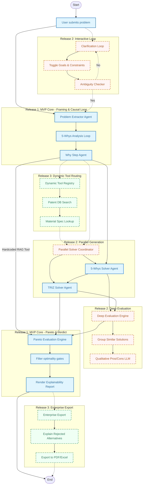

# Agent Reasoning & Execution Flow (by Releases)

This document visualizes and describes the internal reasoning steps, execution pipeline, and tool routing mechanisms of the Maritime R&D Assistant, mapped across the three product release stages.

---

## 🌊 Execution Pipeline Diagram

The flowchart below illustrates how a user's problem is parsed, routed to candidate generators in parallel, evaluated, and explained. The steps are color-coded by release:
*   **Light Blue (Solid)**: Release 1 (MVP Core)
*   **Light Red (Dashed)**: Release 2 (Interactive Loop)
*   **Light Green (Dashed)**: Release 3 (Dynamic Routing & Enterprise)

---

## 🛠️ Step-by-Step Pipeline Breakdown

### 📦 Release 1: MVP Core (Blue Items)
In the initial release, the system operates as a direct execution pipeline focusing on problem framing and causal analysis:
1.  **Problem Framing (Problem Extractor Agent)**: The user submits a problem (e.g. *hull breach*), and the agent extracts key variables, constraints, symptoms, and success metrics.
2.  **Causal Discovery (5-Whys Analysis Loop)**: The agent recursively runs a 5-Whys inquiry chain to isolate the underlying root cause.
3.  **Sequential Candidate Generation**: The agent triggers `5-Whys Solver Agent` and `TRIZ Solver Agent` sequentially.
4.  **Explainability & Pareto Selection**: The best concepts are evaluated via the Pareto engine, the winner is recommended, and the system outputs an explanation detailing *why* it was chosen.

### 🚀 Release 2: Interactive Loop, Parallel Solvers & Deep Evaluation (Red Items)
Release 2 introduces user interaction, parallelization, and a deep evaluation loop:
1.  **Interactive Definition**: Rather than going straight to execution, the agent guides the user to define their goals, focus areas, and what constraints to ignore. If the problem is unclear, it triggers clarification questions.
2.  **Parallel Generation**: Move away from sequential execution in `SequentialAgent` to running candidate research streams concurrently using `ParallelAgent` to minimize overall SSE stream response times.
3.  **Deep Evaluation**: Generated candidates undergo deep evaluation: grouping similar solutions, compiling pros and cons, and scoring candidates before final selection.

### 🌐 Release 3: Dynamic Routing & Enterprise Export (Green Items)
The final tier adds dynamic routing capability and enterprise-grade reporting:
1.  **Dynamic Routing**: The agent analyzes the problem type and dynamically selects from a registry of available tools (e.g. patent databases, chemistry specifications), assigning specific tools to specific candidate agents based on context.
2.  **Enterprise Export**: Along with explaining the chosen concept, the system outputs detailed reports explaining why alternative solutions were rejected and defines concrete next steps for implementation.
