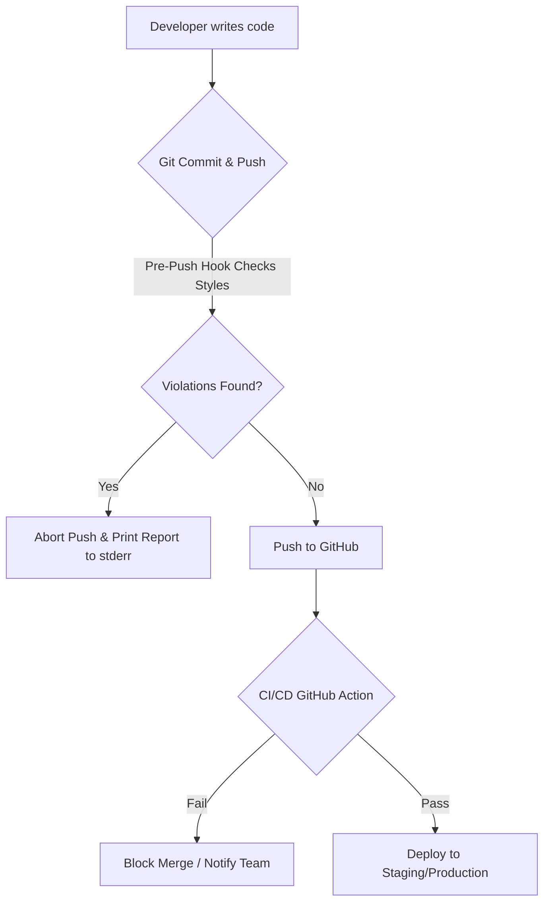

# Design System Guard & Token Verification

This document explains the architecture, enforcement strategy, and workflows implemented to preserve visual integrity, layout consistency, and style isolation in the project.

---

## 🏗️ The Problem: Design System Decay

In fast-paced development environments (and especially teams without a full-time UI/UX designer), design systems often decay over time. Developers accidentally introduce:

- **Magic Numbers**: Hardcoded pixel sizes (`margin: 17px;`) that break grid alignment.
- **Raw Hex Colors**: Hardcoded colors (`background: #3b82f6;`) that break dark mode and theming.
- **Leaky Component Styles**: Styling child elements of nested components from parent stylesheets, breaking view encapsulation.
- **Raw Color Functions**: Functions like `rgba(...)` that should belong strictly to the semantic design token layer.

---

## 🛡️ The Approach: Automated Static Analysis Guard

To solve this with **minimum maintenance overhead**, we implemented an automated static analysis pipeline that invalidates design system violations before they reach production.

The core of this guard is a custom Node.js static analyzer:
[solution-system/scripts/lint-design-tokens.mjs](../../solution-system/scripts/lint-design-tokens.mjs).



### 1. Static Analysis Rules

The linter parses all `.scss` files in the client applications (excluding core token dictionaries) against three main rules:

1. **No Raw Hex Colors**: Direct hex declarations (e.g. `#fff`, `#333333`) are forbidden. Colors must consume semantic tokens (e.g., `var(--color-surface)`).
2. **No Raw Pixel Values**: `px` units for sizes, font-sizes, margins, or padding are forbidden (excluding standard layout borders `1px`/`2px` or focus outlines `3px`). Developers must use `rem` or layout space variables (e.g., `var(--space-4)`).
3. **No Raw Color Functions**: Functions like `rgb()`, `rgba()`, `hsl()` are blocked in components. Any color mixing/alpha calculation must be declared globally or use CSS `color-mix`.

---

## 🚀 How to Work with Styles

### 1. Follow the Three-Tier CSS Custom Properties Architecture

Always define your layout primitives in the global layer and consume them semantically in component SCSS:

- **Tier 1: Primitives** ([_primitives.scss](../../solution-system/apps/frontend/src/styles/tokens/_primitives.scss)): Defines the vocabulary (e.g. `--color-blue-500`, `--space-4`).
- **Tier 2: Semantics** ([_semantic.scss](../../solution-system/apps/frontend/src/styles/tokens/_semantic.scss)): Maps vocabulary to meanings (e.g. `--color-primary`, `--color-surface`).
- **Tier 3: Contextual / Component**: Maps semantics to component overrides.

### 2. Run Style Checks Locally

To check if your local styles conform to the design tokens guidelines, run:

```bash
make lint-tokens
```

Or use the npm script directly:

```bash
npm run lint:tokens
```

---

## ⚙️ Enforcement Mechanisms

### Local Hook Guard

A pre-push hook (`.git/hooks/pre-push`) is installed locally. It intercepts pushes and prints error reports directly to `stderr` to ensure they are visible in all IDE terminal windows:

```text
🛡️  DESIGN SYSTEM LINT CHECK
────────────────────────────────────────────────────────────────────────
📁 File: apps/frontend/src/app/chat/chat-page.scss
  ❌ Line 100: Hardcoded hex color found: "background: #000;"
     ↳ Tip: Use semantic tokens like var(--color-surface) or var(--color-primary).
────────────────────────────────────────────────────────────────────────
 FAIL  Found 1 design token violations. Please use design system variables.
```

### CI/CD Pipeline Guard

Any pull request is validated by the [Design Tokens Lint GitHub Action](../../.github/workflows/lint-styles.yml). A PR cannot be merged into `main` or `dev` if it contains un-tokenized styling rules, ensuring the main branch remains 100% compliant.
